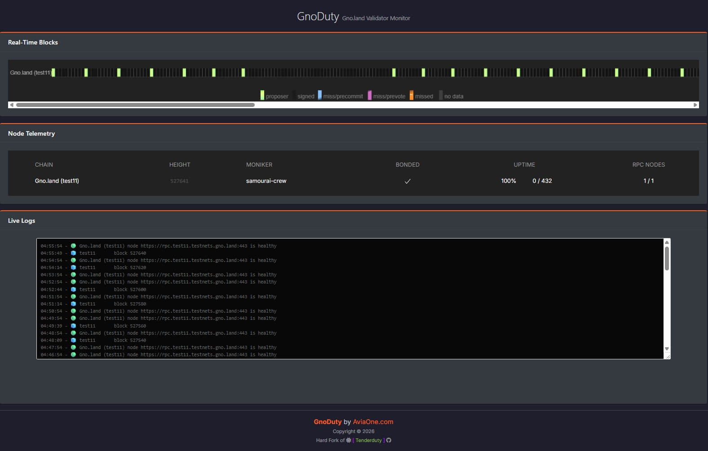

# GnoDuty

Real-time validator monitoring for **Gno.land (TM2)** networks.

Hard fork of [Tenderduty](https://github.com/blockpane/tenderduty) by [blockpane](https://github.com/blockpane), rewritten for Gno.land's Tendermint2 (TM2) architecture.

## Why GnoDuty?

Tenderduty was designed for Cosmos SDK / Tendermint chains. Gno.land uses Tendermint2 (TM2), which has a different RPC response format, different validator address handling, and no WebSocket subscription support on public endpoints.

GnoDuty solves this by:

- Parsing TM2 block format (`precommits` instead of `signatures`)
- Using HTTP polling instead of WebSocket subscriptions
- Supporting bech32 `g1...` validator addresses natively
- Querying TM2-specific endpoints (`/validators`, `/block`)

## Features

- **Real-time block monitoring** - Track block signing with visual canvas display
- **Validator status** - Bonded, jailed, tombstoned, missed blocks, uptime percentage
- **Multi-chain support** - Monitor multiple Gno.land networks from a single instance
- **Alert notifications** - Discord, Telegram, Slack, PagerDuty
- **Web dashboard** - Dark theme, responsive, real-time updates
- **Prometheus exporter** - Metrics for Grafana integration
- **Light/Dark mode** - Toggle from the dashboard footer

## Screenshot



## Quick Start

### Requirements

- Go 1.21 or later, tested with 1.26
- Linux (tested on Ubuntu 24.04)

### Install from source
```bash
git clone https://github.com/AviaOne/gnoduty
cd gnoduty
cp example-config.yml config.yml
# Edit config.yml set your validator address and RPC endpoint
go install
~/go/bin/gnoduty
```

The dashboard will be available at `http://localhost:8889`

### Configuration

Edit `config.yml` before starting. The most important settings:
```yaml
chains:
  # Display name shown on the dashboard (can be anything)
  "Gno.land (test11)":
    # Must match the chain ID from the RPC /status endpoint
    chain_id: test11
    # Your validator address in bech32 format (g1...)
    valoper_address: g1_YOUR_VALIDATOR_ADDRESS
    nodes:
      - url: https://rpc.test11.testnets.gno.land:443
        alert_if_down: yes
```

To verify your chain_id:
```bash
curl -s https://rpc.test11.testnets.gno.land/status | python3 -c "import json,sys; print(json.load(sys.stdin)['result']['node_info']['network'])"
```

See `example-config.yml` for a complete configuration reference with all alert options.

### Run as a systemd service
```bash
sudo useradd -r -s /bin/false -m -d /home/gnoduty gnoduty
sudo -u gnoduty bash -c 'cd ~ && git clone https://github.com/AviaOne/gnoduty && cd gnoduty && go install'
sudo -u gnoduty mkdir -p /home/gnoduty/.gnoduty
sudo -u gnoduty cp /home/gnoduty/gnoduty/example-config.yml /home/gnoduty/.gnoduty/config.yml
# Edit /home/gnoduty/.gnoduty/config.yml
```

Create `/etc/systemd/system/gnoduty.service`:
```ini
[Unit]
Description=GnoDuty - Gno.land Validator Monitor
After=network-online.target
Wants=network-online.target

[Service]
User=gnoduty
Group=gnoduty
Type=simple
WorkingDirectory=/home/gnoduty/.gnoduty
ExecStart=/home/gnoduty/go/bin/gnoduty -f /home/gnoduty/.gnoduty/config.yml
Restart=always
RestartSec=5
LimitNOFILE=65535

[Install]
WantedBy=multi-user.target
```
```bash
sudo systemctl daemon-reload
sudo systemctl enable --now gnoduty
sudo journalctl -u gnoduty -f
```

### Optional: HTTPS with Caddy

To serve the dashboard over HTTPS with a domain name, add a reverse proxy in your Caddyfile:
```
gnoduty.yourdomain.com {
    reverse_proxy localhost:8889
}
```

## Runtime Options
```
$ gnoduty -h
Usage of gnoduty:
  -f string
        configuration file to use (default "config.yml")
  -state string
        file for storing state between restarts (default ".gnoduty-state.json")
  -cc string
        directory containing additional chain specific configurations (default "chains.d")
```

## Directory Structure
```
/home/gnoduty/
├── gnoduty/          # Source code (this repository)
│   ├── core/         # Go source files
│   │   ├── static/   # Frontend files (embedded in binary)
│   │   └── dashboard/
│   ├── main.go
│   ├── example-config.yml
│   └── LICENSE
├── .gnoduty/         # Runtime configuration
│   ├── config.yml
│   ├── .gnoduty-state.json
│   └── chains.d/
├── go/bin/gnoduty    # Compiled binary
└── backups/          # Your backups (not in repo)
```

## What Changed from Tenderduty

GnoDuty is a hard fork with significant modifications to support Gno.land's TM2:

| Component | Tenderduty (Cosmos SDK) | GnoDuty (Gno.land TM2) |
|-----------|------------------------|------------------------|
| Block data | `signatures` field | `precommits` field |
| Connectivity | WebSocket subscriptions | HTTP polling (5s interval) |
| Validator address | Hex / valoper | Bech32 `g1...` |
| Validator lookup | ABCI queries | `/validators` RPC endpoint |
| Signing check | `last_commit.signatures` | `last_commit.precommits` |

See [CHANGELOG.md](CHANGELOG.md) for a detailed breakdown of every file created, modified, and removed.

## Credits

- **Original**: [Tenderduty v2](https://github.com/blockpane/tenderduty) by [Todd G (blockpane)](https://github.com/blockpane), sponsored by the [Osmosis Grants Program](https://grants.osmosis.zone/)
- **Fork**: [GnoDuty](https://github.com/AviaOne/gnoduty) by [AviaOne.com](https://aviaone.com) Adapted for Gno.land TM2

## Disclaimer

The original Tenderduty project was developed [with a $10,000 grant](https://grants.osmosis.zone/grants/tenderduty-v2-validator-monitoring-tool) from the Osmosis Grants Program. 
GnoDuty is currently maintained only by [AviaOne.com](https://aviaone.com) contribution with no funding or sponsorship.

While we strive for quality, we cannot guarantee the same level of support as a funded project. If you encounter bugs, please open an issue on GitHub, we will do our best to address them.

## License

MIT License - See [LICENSE](LICENSE) for details.

Original © 2021 Todd G (blockpane) | Fork © 2026 AviaOne.com
